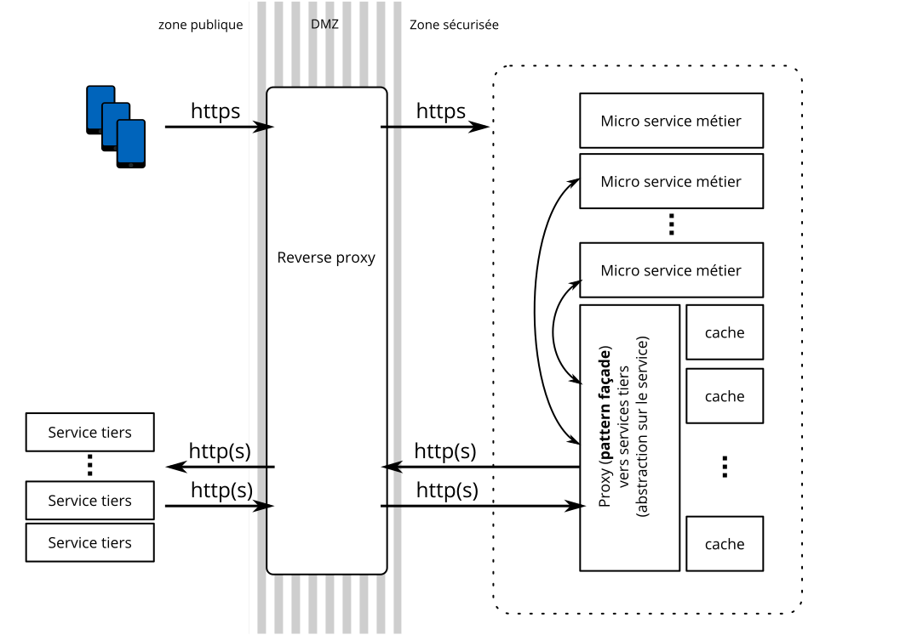

# Reduction de dépendance face aux composants tiers

## Le problème
Afin de se développer rapidement et de déléguer une expertise, on peut faire
appel à des services tiers (ici, par exemple, les apis googel d'itineraires, de geocoding et reverse-geocoding ou encore d'autocomplete).

Malgré la grande qualité de tels services tiers, nous ne sommes jamais à l'abri
de discontinuités de services (abandon du service ou plus simplement pannes). C'est par exemple
le cas de github qui me fait faux bon au moment où j'écris ce document le 6 décembre 2016 (https://status.github.com/messages/2016-12-06). Au travers de ce court document, je vais probablement enfoncer des portes ouvertes, je ne rentrerai pas dans les details techniques propres à telles api ou implémentations.

à propos, il y a quelques années de cela, avec moins de maturité, j'ai rédigé un article sur cette problématique ici: http://www.it-expertise.com/tierces-parties-reelles-economies-ou-pas/

## La solution
Comme présenté à l'oral, le point #1 consiste à se désengager du service à l'aide d'un pattern **facade** sous la forme d'un (micro) service proxy. Au lieu d'acceder directement au service tiers, on crée un intermédiaire qui va prendre la résponsabilité sur le service. Une simplification du schema général est présenté ci-dessous:

Une fois mis en place, si le service est discontinué par le provider tiers, il est possible, dans
une certaine limite de reposer sur un autre service (par exemple, l'équivalent de apple ou microsoft).

Il reste, à mon avis, à définir 1) une modélisation des données (ici, autour de la notion de *place*), 2) de caching des données et 3) de strategie de routing.

### 1 Modélisation
Il est risqué de repdrendre exactement le formalisme proposé par le service tiers. La solution la plus simple est de recenser les données disponibles par l'un ou plusieurs services afin de n'en retenir que le plus petit dénominateur commun.

Ensuite, on peut éventuellement retirer ou compléter les attributs de données pour coller au plus près des besoins identifiés. Je suis d'avis qu'il ne faut pas over-engineerer cette partie car il est toujours difficile d'anticiper les besoins metiers sur le long terme dans les phases préliminaires d'un projet.

Je ne pense pas rentrer plus dans le détail sur cette partie, les apis diverses mentionnent les nommages de lieux, types associés (routes, numéros, bâtiments, pays, etc.), les adresses formattées, localisations (latitude/longitude) et d'éventuelles métadonnées qui peuvent être utiles ou non.

Dans tous les cas, l'on a besoin de faire le pont entre des coordonnées géometriques (latitude, longitute) des des lieux dits. Cette partie est rapidement discutée dan la section suivante.

Modéliser les données ici est simple, l'une des difficultés concerne le requêtage. Une solution *simple* consiste à stocker des latitudes et longitudes de telles manière à pouvoir requêter sur des distances (par exemple, des coordonnées sphériques). Cela pourrait fonctionner mais se montrera probablement très couteux. On pourrait également se reposer sur les capacités de SGBDs à traiter des coordonnées spaciales (https://en.wikipedia.org/wiki/Spatial_database#Spatial_index).

### 2 Caching des données
Définir un modèle est une chose, il faut rendre les données accessibles en cas d'indisponibilité des composants tiers. La créationd du cache peut se faire en 2 phases: 1) bootstrap 2) completion.

Au cours du bootstrap, sur une zone géographique identifiée, on peut quadriller la zone à l'aide des coordonnées (par exemple, tous les 10 mètres) puis requêter le service de reverse-geocoding afin de constituer une première carte reference. A partir de là, pour une localisation donnée (lat-long), il est possible de fournir une approximation à l'aide d'une distance euclidienne ou d'un arrondi. On peut ensuite décomposer les données suivants des critères tels que la rue afin de les rendre accessible en géocoding également.

A l'issue de ce maillage plus ou moins fin, on peut completer les données au fil de l'eau lors de nouvelles requêtes clientes en se reposant, toujours de la même façon, sur le service tiers. On peut également rafraichir des données éventuellement mises à jours sur une localité donnée à tout instant suivant une strategie qui peut varier en fonction des situations envisagées (nouvelles rue, travaux).

Forcément, le cache a de l'intérêt s'il est réactif et permet de compenser l'absence du service tiers. Sans réel contexte, on peut se laisser tenter par un *elastic search* avec du load balancing en fonction de la volumetrie de données et de requêtages.

### 3 strategie de routing des requêtest
Si le modèle de données comprend des données suffisament récentes, on peut se poser la question de la necessité de reposer dessus au lieux du service tiers. Il peut être décidé par le service proxy de ne pas requêter le service tiers et de se reposer directement sur le cache. Des patterns statistiques, en fonction de la fréquence et de la confiance dans les données peuvent permettre de réduire le overhead d'une requête vers ce service externe.

## Références

Le sujet précis de localisation m'étant relativement peu familier, voici quelques références investiguées:

* https://developers.google.com/maps/web-services/?hl=fr
* https://developers.google.com/maps/documentation/geocoding/intro?hl=fr
* https://developers.google.com/places/web-service/autocomplete?hl=fr
